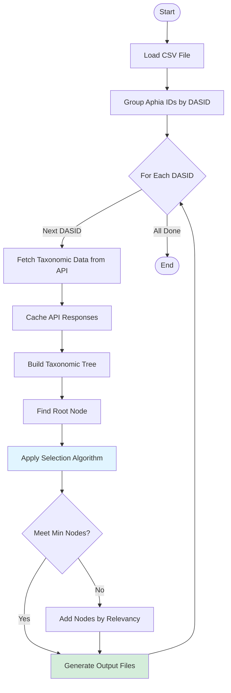
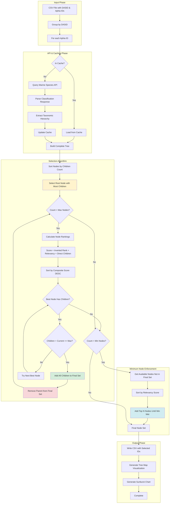
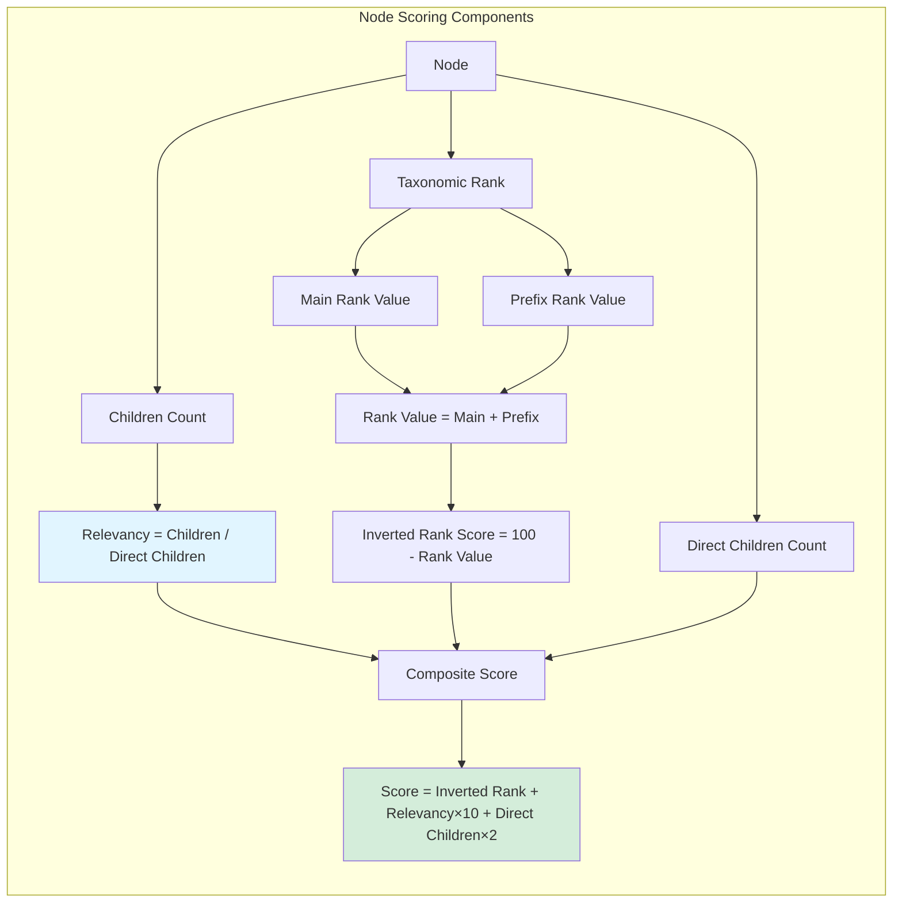
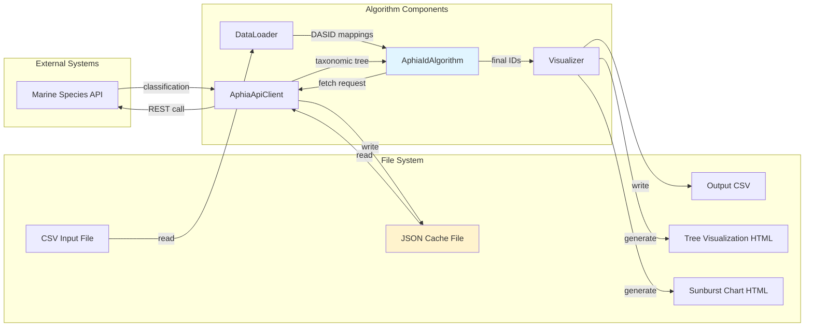
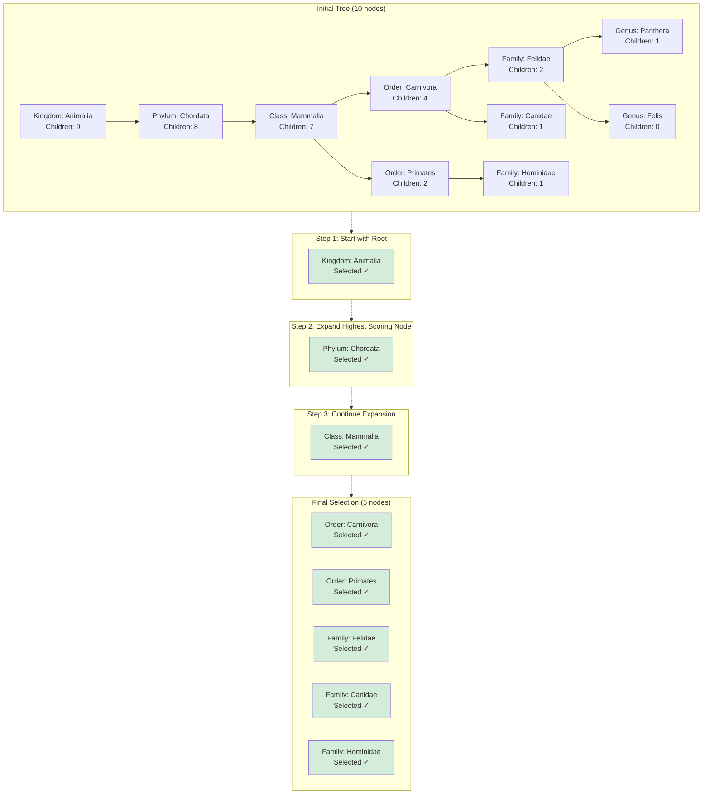

# EurOBIS IMIS Aphia ID Algorithm

Algorithm to determine which Aphia IDs to use based on sorting IDs per DASID, querying via REST calls, caching results in JSON, and processing a tree structure to find optimal final IDs.

## Current Situation

This package implements an algorithm that:

* Loads `aphia_ids_to_imis.csv` containing DASID to Aphia ID mappings
* Sorts Aphia IDs per DASID  
* Performs REST queries on all IDs via the Marine Species API and caches the output in a JSON file
* Loads the cache and applies the algorithm:
  * Finds the root of the tree by counting children and direct children, adding to a `final_ids` list
  * Calculates max relevance per Aphia ID in `final_ids`
  * Counts children per ID in `final_ids`
  * Adds children and removes parents if requirements are met, repeating until depth limit or max nodes reached

## Installation

### From GitHub

```bash
pip install git+https://github.com/cedricdcc/eurobis_imis_aphia_id_algorithm.git
```

### Development Installation

```bash
git clone https://github.com/cedricdcc/eurobis_imis_aphia_id_algorithm.git
cd eurobis_imis_aphia_id_algorithm
pip install -e .
```

### Requirements

- Python 3.7+
- pandas >= 1.0.0
- numpy >= 1.18.0
- requests >= 2.20.0
- plotly >= 4.0.0

Optional dependencies:
- pyodbc >= 4.0.0 (for database connectivity)

## Usage

### As a Python Package

```python
from eurobis_imis_aphia_id_algorithm import AphiaIdAlgorithm

# Initialize the algorithm
algorithm = AphiaIdAlgorithm(
    max_nodes=50,          # Maximum nodes per DASID
    min_nodes=1,           # Minimum nodes per DASID (NEW!)
    amplifier=10,          # Rank scoring amplifier
    cache_file="data_object.json"  # Cache file name
)

# Process a CSV file with DASID-Aphia ID mappings
results = algorithm.process_csv_file(
    "aphia_ids_to_imis.csv",
    refresh_cache=False,        # Set True to refresh API cache
    save_visualizations=True,   # Generate HTML visualizations
    show_visualizations=False   # Show visualizations in browser
)

# Process results
for dasid, result in results.items():
    print(f"DASID {dasid}: {len(result['final_ids'])} final IDs selected")
    print(f"CSV output: {result['csv_file']}")
    print(f"Tree visualization: {result['html_file']}")
    print(f"Sunburst visualization: {result['sunburst_file']}")  # NEW!
```

### Command Line Interface

```bash
# Basic usage
aphia-algorithm path/to/your/aphia_ids_to_imis.csv

# With options
aphia-algorithm data.csv --max-nodes 100 --min-nodes 5 --refresh-cache --show-visualizations
```

### Example Script

See `examples/demo_usage.py` for a complete example that replicates the original `demo_algorithm.py` behavior:

```bash
python examples/demo_usage.py
```

## API Reference

### AphiaIdAlgorithm

Main algorithm class for determining optimal Aphia IDs.

**Parameters:**
- `max_nodes` (int): Maximum number of nodes to select per DASID (default: 50)
- `min_nodes` (int): Minimum number of nodes to select per DASID (default: 1) **NEW!**
- `amplifier` (int): Multiplier for rank scoring (default: 10)
- `cache_file` (str): Name of the cache file (default: "data_object.json")
- `base_path` (str): Base directory path for file operations (default: "")

**Methods:**
- `process_csv_file(csv_file, refresh_cache=False, save_visualizations=True, show_visualizations=False)`: Process all DASIDs from a CSV file
- `process_dasid(dasid, aphia_ids, refresh_cache=False, save_visualizations=True, show_visualizations=False)`: Process a single DASID
- `apply_algorithm(all_data)`: Apply the core algorithm to taxonomic data

### DataLoader

Handles loading and processing of CSV files.

**Methods:**
- `load_aphia_ids_csv(csv_file)`: Load CSV file containing Aphia ID mappings
- `group_aphia_ids_by_dasid(df)`: Group Aphia IDs by DASID from DataFrame
- `load_and_process_csv(csv_file)`: Combined load and process operation

### AphiaApiClient

Client for interacting with the Aphia API and managing cache.

**Methods:**
- `fetch_and_cache_dasid_data(dasid, aphia_ids, refresh_cache=False)`: Fetch and cache data for a DASID
- `get_classification_by_aphia_id(aphia_id)`: Get taxonomic classification for an Aphia ID
- `load_cache(force_refresh=False)`: Load cached data from file
- `save_cache(cached_data=None)`: Save cached data to file

## Testing

Run the test suite:

```bash
pytest
```

Run tests with coverage:

```bash
pytest --cov=eurobis_imis_aphia_id_algorithm --cov-report=html
```

## Input Format

The CSV file should contain the following columns:
- `IMIS_DasID`: Dataset identifier
- `aphia_id`: Aphia ID from the World Register of Marine Species

Example:
```csv
IMIS_DasID,aphia_id
4445,12345
4445,12346
8022,23456
```

## Output

For each DASID, the algorithm produces:
- `{dasid}_chosen_aphia_ids.csv`: Selected Aphia IDs with taxonomic information
- `{dasid}_tree_view.html`: Interactive tree map visualization (if enabled)
- `{dasid}_sunburst.html`: Interactive sunburst chart visualization (if enabled) **NEW!**

## Visualizations

The algorithm generates two types of interactive visualizations:

### Tree Map Visualization
- Shows hierarchical structure as nested rectangles
- Color-coded: pink (final+original), royalblue (final only), red (original only), grey (other)
- Includes hover information with taxonomic details

### Sunburst Chart Visualization **NEW!**
- Displays taxonomic hierarchy as concentric circles radiating from center
- Each ring represents a taxonomic rank (Kingdom → Phylum → Class → etc.)
- Interactive navigation: click segments to zoom into subtrees
- Same color coding as tree map for consistency
- Handles complex hierarchies and circular references safely

## Algorithm Details

### High-Level Overview

The EurOBIS IMIS Aphia ID Algorithm reduces a large set of taxonomic identifiers (Aphia IDs) to an optimal subset that maintains taxonomic coverage while staying within specified limits. The algorithm operates on a per-DASID (Dataset ID) basis.



### Core Algorithm Steps

The algorithm works by:

1. **Data Loading**: Reads CSV file and groups Aphia IDs by DASID
2. **API Querying**: Fetches taxonomic classification data from Marine Species API
3. **Caching**: Stores API responses in JSON format for efficiency
4. **Tree Root Finding**: Identifies root nodes based on children counts
5. **Relevance Calculation**: Computes relevance scores based on taxonomic hierarchy
6. **Iterative Selection**: Adds children and removes parents until max nodes or depth reached
7. **Minimum Node Enforcement**: Ensures at least `min_nodes` are selected by adding additional nodes by relevancy
8. **Output Generation**: Creates CSV files and HTML visualizations (tree map and sunburst chart)

### Detailed Algorithm Workflow



### Relevancy Calculation

The algorithm uses a sophisticated scoring system to determine which nodes to expand:



**Rank Values** (with default amplifier=10):
- **Domain**: 80
- **Kingdom**: 70
- **Phylum**: 60
- **Class**: 50
- **Order**: 40
- **Family**: 30
- **Genus**: 20
- **Species**: 10

**Prefix Modifiers**:
- **Mega-**: +4
- **Giga-**: +3
- **Super-**: +2
- **Sub-**: -2
- **Infra-**: -3
- **Parv-**: -4

### Data Flow



### Example: Tree Reduction Process

Here's how the algorithm reduces a taxonomic tree from 10 nodes to a target of 5 nodes:



The algorithm prioritizes:
1. **Lower taxonomic ranks** (Species > Genus > Family) to maintain specificity
2. **Nodes with children** to enable further expansion
3. **High relevancy** (good children/direct children ratio) for balanced coverage

## Development

### Project Structure

```
eurobis_imis_aphia_id_algorithm/
├── eurobis_imis_aphia_id_algorithm/    # Main package
│   ├── __init__.py                     # Package initialization
│   ├── algorithm.py                    # Core algorithm implementation
│   ├── api_client.py                   # API client and caching
│   ├── data_loader.py                  # CSV loading utilities
│   ├── utils.py                        # Utility functions
│   ├── visualization.py               # Plotting and output
│   └── cli.py                          # Command-line interface
├── tests/                              # Test suite
├── examples/                           # Usage examples
└── setup.py                           # Package configuration
```

### Contributing

1. Fork the repository
2. Create a feature branch
3. Add tests for new functionality
4. Ensure all tests pass
5. Submit a pull request

## License

This project is licensed under the MIT License.
